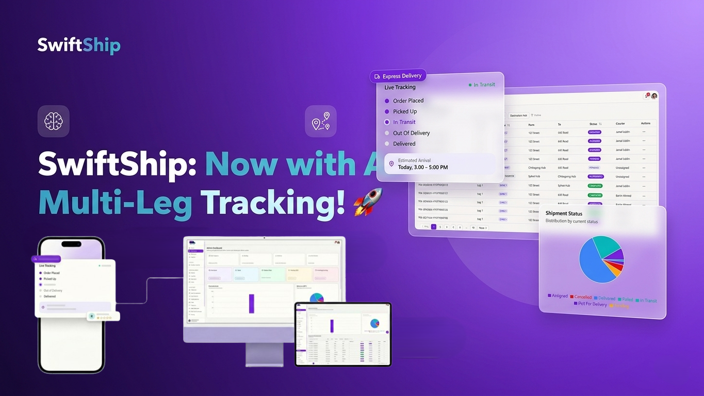
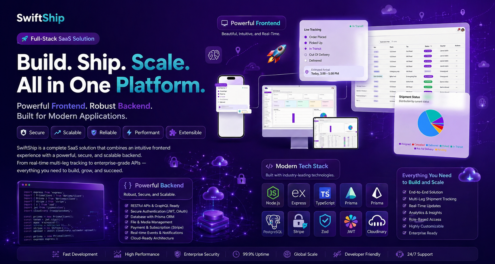

# SwiftShip -- Courier Management System (Frontend)

Frontend for SwiftShip, a full-featured courier and delivery management platform with integrated AI capabilities. Built with Next.js 16, React 19, TanStack Query, TanStack Form, shadcn/ui, and Tailwind CSS v4.

[](https://nextjs.org/)
[](https://react.dev/)
[](https://www.typescriptlang.org/)
[](https://tailwindcss.com/)

---



---

## Live Demo

- Frontend App: https://swiftship-frontendv1.vercel.app
- Backend API: https://swiftship-backend.vercel.app
- Live video overview: https://drive.google.com/file/d/1tifUZPwJU50tc23QoKL6e_zqzNV1w-aR/view?usp=sharing

## Test Credentials

```
Super Admin: superadmin@courier.com / Password@123
Admin:       admin@courier.com / Password@123
Courier:     rahim.courier@example.com / Password@123 (Dhaka, BIKE)
Courier:     karim.courier@example.com / Password@123 (Chittagong, BICYCLE)
Merchant:    fatima@shopbd.com / Password@123
User:        ayesha@example.com / Password@123
```

---

## Tech Stack

| Layer | Library |
|---|---|
| Framework | Next.js 16 (App Router) |
| Language | TypeScript 5 |
| Styling | Tailwind CSS v4 + shadcn/ui |
| Server State | TanStack Query v5 |
| Forms | TanStack Form v1 |
| Tables | TanStack Table v8 |
| Validation | Zod v4 |
| HTTP Client | Axios |
| Charts | Recharts |
| Notifications | Sonner |
| AI | Google Gemini API (via Next.js API routes) |
| Theming | next-themes |

---

## AI-Powered Features

SwiftShip integrates AI throughout the platform to provide intelligent, context-aware assistance to every user role. All AI features are powered by Google Gemini and served through dedicated Next.js API routes.

### Shipment Journey Summarization

When tracking a shipment, users can generate a plain-language summary of the entire shipment journey. The AI reads the full status timeline, pickup/delivery details, and leg history, then produces a concise human-readable summary explaining where the package has been, where it is now, and what to expect next. Available to all roles from the Track Shipment page.

### Price Explanation

During shipment creation, after the system calculates the delivery price based on city, weight, and service tier, users can request an AI-generated explanation of the pricing breakdown. The AI takes the base rate, weight surcharge, express fees, and total, then explains in clear language why the price is what it is. This builds transparency and trust in the pricing model.

### Role-Based Dashboard Insights

Each dashboard features an AI Insights Widget that generates actionable intelligence from live platform data:

- **Admin Dashboard** -- Analyzes shipment volumes, courier performance, revenue trends, and settlement data across the entire platform. Surfaces operational bottlenecks and growth opportunities.
- **Merchant Dashboard** -- Reviews the merchant's shipment history, delivery success rates, and spending patterns. Provides recommendations for optimizing shipping costs and delivery times.
- **Courier Dashboard** -- Examines completed deliveries, earnings history, active legs, and COD settlements. Offers suggestions for maximizing earnings and improving delivery efficiency.
- **User Dashboard** -- Looks at the user's shipment history and delivery patterns. Gives personalized tips on shipping options and cost savings.

Each role hits its own dedicated API endpoint (`/api/ai-insights`, `/api/ai-merchant-insights`, `/api/ai-courier-insights`, `/api/ai-user-insights`) so the AI prompt and data context are tailored precisely to what that role needs.

### SwiftShip Assistant (Chatbot)

A floating chatbot is available on every page of the application. Users can ask questions about how to create shipments, track packages, understand pricing, navigate the dashboard, or get help with any SwiftShip feature. The assistant is context-aware and responds with relevant, actionable guidance. Powered by `/api/chat`.

---

## Prerequisites

- Node.js 20 or higher
- Bun 1.3 or higher -- [bun.sh](https://bun.sh)
- Backend server running at `http://localhost:5000` -- see [Backend README](../L2B6A5-Backend-Management-System/README.md)

---

## Getting Started

**1. Install dependencies**

```bash
bun install
```

**2. Set up environment variables**

Create a `.env.local` file in the project root:

```env
NEXT_PUBLIC_API_BASE_URL=http://localhost:5000/api/v1
JWT_ACCESS_SECRET=your_super_secret_access_token_key_here
GEMINI_API_KEY=your_google_gemini_api_key_here
```

> `JWT_ACCESS_SECRET` must match `ACCESS_TOKEN_SECRET` in the backend `.env`.

**3. Start the development server**

```bash
bun dev
```

App runs at `http://localhost:4000`

**4. Build for production**

```bash
bun run build
bun start
```

---

## Project Structure

```
src/
├── app/
│   ├── (commonLayout)/          # Public pages (home, login, register, about, contact, services, privacy, terms)
│   ├── (dashboardLayout)/       # Protected dashboard pages
│   │   ├── admin/dashboard/     # Admin routes
│   │   ├── courier/dashboard/   # Courier routes
│   │   ├── merchant/dashboard/  # Merchant routes
│   │   └── dashboard/           # User routes
│   ├── api/                     # Next.js API routes (AI endpoints, chat)
│   └── globals.css
├── components/
│   ├── modules/                 # Feature-specific components
│   │   ├── Auth/                # Login, Register, Courier Registration
│   │   ├── Dashboord/           # Dashboard content for all roles
│   │   ├── Home/                # Homepage sections (Hero, AI, Stats, FAQ, Newsletter, Partners, Footer)
│   │   ├── Admin/               # Admin-specific components (AIInsightsCard)
│   │   └── Shipment/            # Shipment tracking, creation, labels
│   ├── shared/                  # Reusable components (table, form, charts, AIInsightsWidget, Chatbot)
│   └── ui/                      # shadcn/ui primitives
├── hooks/                       # Custom React hooks
├── lib/                         # Utilities (auth, nav, jwt, cookies, servicesData)
├── providers/                   # QueryProvider, ThemeProvider, SmoothScrollProvider
├── services/                    # Server actions (API calls)
├── types/                       # TypeScript interfaces
├── zod/                         # Zod validation schemas
└── proxy.ts                     # Next.js middleware (auth + route guard)
```

---

## User Roles and Routes

| Role | Dashboard Route | Key Pages |
|---|---|---|
| `SUPER_ADMIN` / `ADMIN` | `/admin/dashboard` | Couriers, Merchants, Users, Shipments, Payments, Pricing, Hubs, Legs, Hub Transfers, COD Settlement, Merchant Settlement, Analytics, Notifications, AI Insights |
| `COURIER` | `/courier/dashboard` | Available Legs, My Active Legs, Earnings, COD Settlement, Delivery History, Track Shipment, Notifications, AI Insights |
| `MERCHANT` | `/merchant/dashboard` | My Shipments, Create Shipment, Settlement History, Track Shipment, Notifications, AI Insights |
| `USER` | `/dashboard` | My Shipments, Create Shipment, Track Shipment, Notifications, AI Insights |

Route access is enforced by the middleware in `src/proxy.ts`. Unauthenticated users are redirected to `/login`. Authenticated users accessing the wrong role's route are redirected to their own dashboard.

---

## Key Features

### Authentication
- JWT stored in non-httpOnly cookies for cross-origin requests
- Tokens sent via Authorization header
- Automatic token refresh via `x-refresh-token` header
- Middleware-level route protection per role
- Client-side navigation after login for proper cookie handling
- Demo credential quick-fill buttons on the login page
- Google sign-in button (placeholder for future OAuth integration)

### Profile Management
- Inline profile editing for name and phone number
- Profile image upload with base64 encoding (Vercel-compatible)
- Image preview before upload
- Profile images displayed in navbar, sidebar, and user dropdown
- Cloudinary integration for image storage
- Automatic fallback to user initials when no image

### Notifications
- Real-time notification dropdown with unread count badge
- Mark as read functionality with checkmark button
- Auto-refresh every 30 seconds
- Role-based notification pages for all user types
- Admin can view all system notifications with user info

### Shipment Management
- Phone number fields for pickup and delivery contacts
- Shipment tracking with detailed status timeline
- AI-generated shipment journey summaries
- Print shipping labels and leg stickers
- Bulk carton label printing
- Shipment cancellation support

### Return System
- Delivery refusal handling with automatic return leg creation
- Reverse routing from delivery location back to origin hub
- Single return shipping charge (equal to original delivery cost)
- Infinite loop protection -- stores package at nearest hub after second refusal
- Return reason tracking and notifications
- Automatic shipment status updates to RETURNED

### Shipment Creation
- No manual amount input -- price is fetched live from `/pricing/calculate` as you fill in city and weight
- Full price breakdown shown before submit (base, weight charge, express surcharge, total)
- AI-powered price explanation on demand
- Phone number validation for pickup and delivery

### Courier Features
- Available legs management with city-based filtering
- Active legs tracking with pickup and delivery actions
- Earnings dashboard with total and pending COD
- COD settlement history
- Delivery history with completed shipments
- City selection for courier profile

### Admin Features
- Hub management and hub transfers
- Legs management with assign/unassign functionality
- COD settlement for couriers
- Merchant settlement management
- Pricing configuration (LOCAL / NATIONAL / INTERNATIONAL)
- User, courier, and merchant management
- Platform-wide analytics dashboard

### Data Tables
- Server-managed search, filter, sort, and pagination via URL query params
- Reusable `DataTable`, `DataTableSearch`, `DataTableFilters`, `DataTablePagination` components
- Proper data access patterns for paginated API responses

### Charts
- Shipment bar chart and pie chart on admin dashboard using Recharts

### Homepage
- Hero section with call-to-action
- AI features showcase section
- Platform statistics with animated counters
- Service tier highlights (Local, National, International)
- How It Works walkthrough
- Testimonials carousel
- FAQ accordion
- Newsletter subscription
- Partner logos
- Responsive design across all breakpoints

### Public Pages
- About Us -- company story and mission
- Contact Us -- contact form and information
- Services -- detailed service plans with individual pages per tier
- Privacy Policy
- Terms of Service

### Theming and UX
- Light and dark mode toggle via next-themes
- Smooth scrolling across the application
- Responsive sidebar navigation for dashboards
- Consistent design language with purple primary and cyan accent

---

## Environment Variables

| Variable | Required | Description |
|---|---|---|
| `NEXT_PUBLIC_API_BASE_URL` | Yes | Backend API base URL |
| `JWT_ACCESS_SECRET` | Yes | Must match backend `ACCESS_TOKEN_SECRET` |
| `GEMINI_API_KEY` | Yes | Google Gemini API key for AI features |

---

## Scripts

```bash
bun dev          # Development server with hot reload (port 4000)
bun run build    # Production build
bun start        # Start production server (port 4000)
bun run lint     # Run ESLint
```

---

## Design

- Primary color: Purple `oklch(0.52 0.26 295)`
- Accent color: Cyan `oklch(0.72 0.15 195)`
- Background: Off-white `oklch(0.98 0.004 80)`
- Sidebar: Deep purple `oklch(0.22 0.08 295)`
- Hover effects: 70-80% opacity for subtle interaction feedback
- Full dark mode support with dedicated color palette

---

## Related

- [Backend Repository](../L2B6A5-Backend-Management-System/README.md)
- [API Documentation](../L2B6A5-Backend-Management-System/API_DOCUMENTATION.md)
